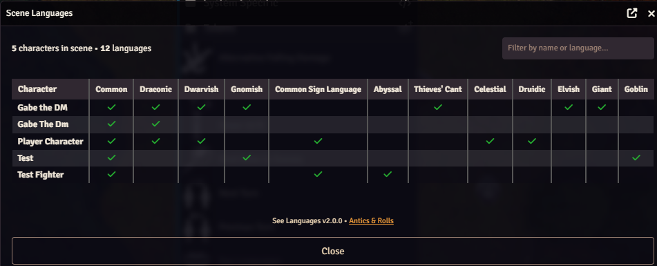
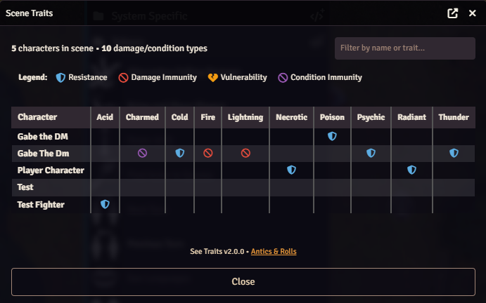

# Antics & Rolls Macros

A curated collection of Foundry Virtual Tabletop macros from **Antics & Rolls**, built to speed up play, support memorable table moments, and give GMs and players a few extra tools to work with.

If you'd like to support the project and the work behind it, you can do that on [Patreon](https://www.patreon.com/c/anticsandrolls).

## What This Module Includes

This module packages a growing collection of reusable Foundry macros into a single installable module, making it easy to drop them into your world and start using them right away.

These macros are intended to help with:

- table utility and quality-of-life actions
- flavorful roleplay and scene support
- quick GM tools
- fun little extras for the Antics & Rolls style of play

## Macro Collection

Here are just a few of the macros in the collection

### [Alternative Falling Damage]

A Foundry VTT macro that resolves falling damage using variant rules with escalating dice based on distance fallen. 
It optionally prompts for Dexterity (Acrobatics) checks to halve the damage, and can create Midi-QOL damage cards for easy damage application.

### [Find Actor in Scenes]

Find which scenes contain tokens representing currently open actors.

### [See Languages]

A Foundry VTT macro that displays a table of all tokens in the current scene and the languages they know. 
Languages are sorted by how many characters speak them, making it easy to spot shared and unique languages.

### [See Resistances]

A Foundry VTT macro that displays a cross-reference table of all tokens' damage resistances, immunities, vulnerabilities, and condition immunities.
Each damage/condition type is a column, each token is a row, and cells show icons indicating the trait type.

## Installation

Install this module in Foundry VTT using the latest release manifest URL below:

`https://github.com/GabeAntics/Antics-Rolls-Macros/releases/latest/download/module.json`

## Repository

Source, updates, and release downloads are hosted here:

[github.com/GabeAntics/Antics-Rolls-Macros](https://github.com/GabeAntics/Antics-Rolls-Macros)

## Support

If you enjoy these macros and want to help support future updates, behind-the-scenes work, and more Antics & Rolls content, visit:

[Patreon: Antics & Rolls](https://www.patreon.com/c/anticsandrolls)
